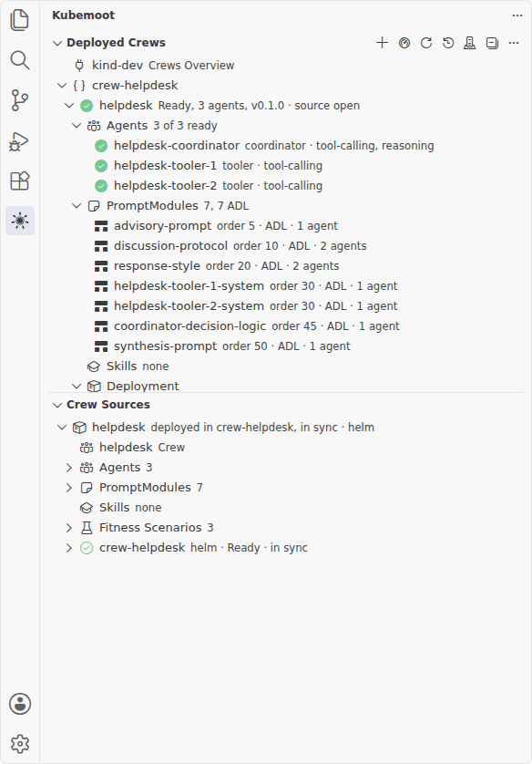

**CrewForge** is a VS Code extension for building and running Kubemoot crews without
leaving the editor. You scaffold a crew, edit it as code, deploy it to a namespace with
Helm, ask it questions, run its fitness scenarios, and see how the running crew differs
from your source.

It works through your kubeconfig, the same way [`kmctl`](../kmctl/) does: the chat
reaches a crew's discussion gateway through the Kubernetes API server's service proxy,
so no crew needs a public address and no extra credential is involved. CrewForge writes
only Kubemoot resources and Helm releases of them. The operator owns cleanup.

## A 60-second tour

1. Click the Kubemoot mark in the activity bar. **Deployed Crews** lists the crews your
   kubeconfig can read, grouped by namespace. **Crew Sources** lists the crews in your
   workspace.
2. Click a crew, deployed or in your workspace, to open its dashboard: an overview, the
   source it renders, its live objects, and the diff between the two.
3. Choose **Ask** on a deployed crew to open a chat. Type a question and press Enter;
   each agent reports as it works, then the crew's answer follows.
4. Right-click a folder in the Explorer and choose **New Kubemoot Crew Here** to
   scaffold a crew, then **Deploy to Namespace...** to run it.

## Where to go next



For the end-to-end workflow, start with
[Develop a crew in VS Code](develop-a-crew/). To install the extension, start with
[Install and connect](install-and-connect/).

## Status

CrewForge installs from the `.vsix` attached to each
[GitHub release](https://github.com/kubemoot/vscode-crewforge/releases). Listings in the
Visual Studio Marketplace and Open VSX are coming. It needs VS Code 1.95 or later.

## Related pages

- [kmctl](../kmctl/): the command-line counterpart, and the tool CrewForge calls to
  scaffold a crew.
- [Build a Crew](../../user-guides/build-a-crew/): the resource-level workflow the
  editor workflow wraps.
- [Define Fitness Functions](../../user-guides/define-fitness-functions/): write the
  scenarios Run Fitness executes.
- [Installation](../../introduction/installation/): install the operator CrewForge
  talks to.
